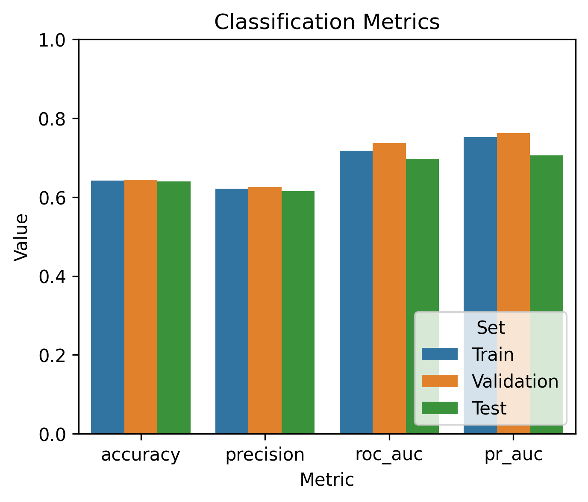
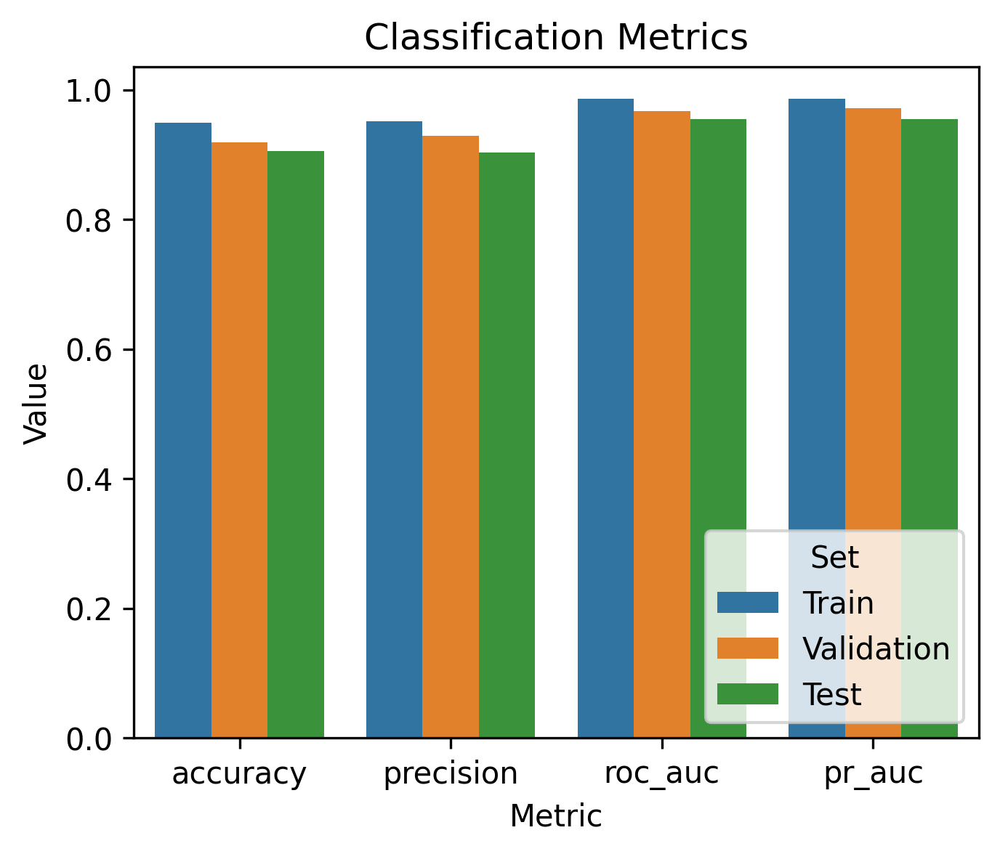

# GPT-2 Text Classifier

A from-scratch GPT-2 architecture fine-tuned for text classification. 
Designed around a decoupled, configuration-driven data pipeline, this platform 
ingests any local or remote two-column dataset (`text, label`) without code modification.

Inspired by Sebastian Raschka’s work, **Build a Large Language Model (From Scratch)**, 
this project is developed to help students and practitioners iteratively build and test 
differnt GPT-2 architectures by using a modular, production-ready ML platform.

It also features complete metric suite for model evaluation and offers optional 
Distributed Data Parallel (DDP) support for scaling training seamlessly across multiple GPUs or nodes.

## Setup & Installation

### 1. Clone the Repository

Clone the repository to your local machine (See below for deployment on Google Colab or Lightning AI Studio). 
This command checks out the `main` branch and places it into a clean `gpt2-classifier` directory:

```bash
git clone https://github.com/paymantohidifar/gpt2-text-classifier-from-scratch.git --branch main gpt2-classifier
cd gpt2-classifier

```

This platform supports automatic dependency resolution for both **CPU-only** and
**CUDA-enabled** environments on **Linux (64-bit)** and should also support
**Windows (64-bit)** and **macOS (Apple Silicon/ARM64)**. However, it is only tested 
and verified on Linux (64-bit) system.

### 2. Fast Local Installation via `uv`

[uv](https://github.com/astral-sh/uv) is an ultra-fast Python package
installer and resolver.

**For a lightweight CPU-only environment:**

```bash
# Optional: Preview the dependency resolution without installing packages
uv sync --extra cpu --extra dev --dry-run

# Create the virtual environment and install CPU + Dev packages
uv sync --extra cpu --extra dev

# Run the test suite to verify the installation
uv run pytest

```

**For a CUDA-enabled (GPU) environment:**

```bash
# Optional: Preview the dependency resolution without installing packages
uv sync --extra gpu --extra dev --dry-run

# Create the virtual environment and install GPU + Dev packages
uv sync --extra gpu --extra dev

# Run the test suite to verify the installation
uv run pytest

```

### 3. Local Installation via `pixi` (Isolated Environments)

If you use [Pixi](https://pixi.sh/) for system-level dependency encapsulation,
your packages are managed completely automatically inside a local, hidden `.pixi/` directory.

**For a CPU-only environment:**

```bash
# Optional: Preview the dependency resolution without installing packages
pixi update

# Install the default environment profile (CPU + Dev tools)
pixi install       

# Run the test suite via the built-in Pixi task
pixi run test

```

**For a CUDA-enabled (GPU) environment:**

```bash
# Optional: Preview the dependency resolution without installing packages
pixi update

# Install the dedicated hardware-accelerated environment profile
pixi install -e gpu-env

# Run the test suite inside the GPU environment context
pixi run test

```

### 4. Google Colab (CPU/GPU)

To finetune/train or evaluate this model using full hardware acceleration on Google Colab,
you must prepare the runtime container first.

> **Required Step:** In the top menu of your Colab notebook, navigate to
**Runtime → Change runtime type**, select **CPU** or **T4 GPU** (or higher), and click **Save**.

Paste and execute the following block in the very first cell of your notebook
to clone the codebase and initialize the CPU or high-speed GPU runtime session. Repo cloning 
and installation process can also be executed directly on a Colab terminal session.

```python
# Clear any stale directories and clone a fresh copy of the codebase
!rm -rf /content/gpt2-classifier
!git clone https://github.com/paymantohidifar/gpt2-text-classifier-from-scratch.git --branch main gpt2-classifier
%cd gpt2-classifier

# Bootstrap uv globally and pull GPU-enabled binaries directly into the system layer
!curl -LsSf https://astral.sh/uv/install.sh | sh && \
export PATH="$HOME/.local/bin:${PATH}" && \
uv pip install -e .[gpu,dev] \
        --system \
        --break-system-packages \
        --color never

```

Replace `gpu` with `cpu` in the installation command (`uv pip install -e .[cpu,dev]`) 
when setting up on a machine without NVIDIA CUDA support.

> **Important:** Once the cell finishes running, navigate to **Runtime → Restart session** in the top menu. This clears Colab's background Python cache so it can successfully read the newly installed packages.


### 5. Lightning AI Studio (CPU/GPU)

Unlike Google Colab, Lightning AI Studio gives you a persistent cloud environment: your libraries, code, and downloaded weights stay intact across sessions, so there's no re-installation friction when you disconnect, reconnect, or switch between CPU and GPU.

It also offers 1-4 free GPUs for up to 40 hours, which pairs well with `torchrun` for DDP-based multi-GPU training.

**Setup procedure:**

1. Create a free account at [lightning.ai](https://lightning.ai/) and open a new Studio.
2. Select your desired machine (CPU, single GPU, or multi-GPU) from the Studio's hardware picker — you can change this later without losing your environment.
3. Open the Studio's built-in terminal and run the following block once to clone the codebase and install dependencies:

```bash
# Clone the codebase
git clone https://github.com/paymantohidifar/gpt2-text-classifier-from-scratch.git --branch main gpt2-classifier
cd gpt2-classifier

# Bootstrap uv and install GPU-enabled packages
curl -LsSf https://astral.sh/uv/install.sh | sh
export PATH="$HOME/.local/bin:${PATH}"
uv sync --extra gpu --extra dev

```

Replace `gpu` with `cpu` in the installation command (`uv sync --extra cpu --extra dev`) when working on a CPU-only Studio.

> **Note:** Because Studios are persistent, this setup only needs to run once. On future sessions, simply reopen the Studio — your environment, code, and downloaded weights will already be in place.

4. Verify the installation:

```bash
uv run pytest

```

## CLI usage

All commands are run as `python -m gpt2_classifier <subcommand> ...` (or
`uv run python -m gpt2_classifier ...` or `pixi run python -m gpt2_classifier ...` locally).

Below are key CLI commands and flags. To view detailed option descriptions and default parameters for any specific subcommand, pass the --help flag:

| Command | Description | Example |
|---|---|---|
| `download-weights` | Fetch a pretrained GPT-2 checkpoint from HuggingFace. | `python -m gpt2_classifier download-weights --model-name "gpt2-small (124M)"` |
| `train` | Fine-tune a classifier on a built-in or custom dataset (see flags below). | `python -m gpt2_classifier train --dataset sms-spam --num-epochs 5` |
| `predict` | Classify a piece of text with a fine-tuned checkpoint. | `python -m gpt2_classifier predict --checkpoint models/sms-spam_classifier.pt --text "..."` |
| `generate` | Raw GPT-2 text generation (debug helper to sanity-check pretrained weights; not classification). | `python -m gpt2_classifier generate --prompt "Every effort moves"` |

### `train` flags

| Flag | Description |
|---|---|
| `--dataset {sms-spam,email-spam}` | Use a built-in registered dataset (default `sms-spam`). |
| `--data-url` / `--data-path` | Bring your own dataset from a remote URL or local file instead. |
| `--text-column` / `--label-column` / `--label-map` | Required with `--data-url`/`--data-path` — describe the raw columns and label encoding, e.g. `--label-map "ham=0,spam=1"`. |
| `--num-epochs` | Number of fine-tuning epochs (default `5`). |
| `--use-wandb` | Enable Weights & Biases experiment tracking. |
| `--ddp` | Multi-GPU training via `torchrun`. |
| `--lora-enabled` | Fine-tune via frozen-backbone LoRA adapters instead of unfreezing the last transformer block (see [LoRA fine-tuning](#lora-fine-tuning) below). |
| `--lora-rank` / `--lora-alpha` | Rank and scaling factor for the LoRA decomposition (only used with `--lora-enabled`, default `16`/`16`). |

## Examples

**Quickstart: SMS spam classifier end to end**


```bash
python -m gpt2_classifier download-weights --model-name "gpt2-small (124M)"
python -m gpt2_classifier train --model-name "gpt2-small (124M)" --dataset sms-spam --num-epochs 5
python -m gpt2_classifier predict --checkpoint models/sms-spam_classifier.pt \
  --text "Congratulations! You've won a free prize, call now to claim!!!"
# -> spam
```

*SMS-spam dataset source: https://archive.ics.uci.edu/static/public/228/sms+spam+collection.zip*


**Using the built-in email spam dataset instead**

```bash
python -m gpt2_classifier train --model-name "gpt2-small (124M)" --dataset email-spam --num-epochs 5
python -m gpt2_classifier predict --checkpoint models/email-spam_classifier.pt --text "Hey, lunch tomorrow?"
# -> ham
```
*Email-spam dataset source: https://raw.githubusercontent.com/MWiechmann/enron_spam_data/master/enron_spam_data.csv"*


**Bringing your own dataset**

```bash
python -m gpt2_classifier train \
  --data-path my_reviews.csv \
  --text-column review_text \
  --label-column sentiment \
  --label-map "negative=0,positive=1" \
  --num-epochs 5
```

## LoRA Fine-Tuning

By default, `train` freezes the pretrained GPT-2 backbone and only unfreezes
the last transformer block + final norm before training the classifier head.
Passing `--lora-enabled` switches to
[LoRA](https://arxiv.org/abs/2106.09685) (Low-Rank Adaptation) instead: the
**entire** backbone stays frozen, and every linear layer in the model gets a
small, trainable low-rank adapter (`--lora-rank`/`--lora-alpha` control its
size) added alongside it. Only the LoRA adapters and the fresh classification
head are trained, which means far fewer trainable parameters and lower
memory/compute requirements -- useful on constrained hardware or when
fine-tuning larger GPT-2 variants.

```bash
python -m gpt2_classifier train \
  --model-name "gpt2-small (124M)" \
  --dataset sms-spam \
  --num-epochs 5 \
  --lora-enabled \
  --lora-rank 8 \
  --lora-alpha 16
```

LoRA fine-tuning also works with `--ddp` for multi-GPU training, since the
backbone freezing/adapter injection happens before the model is handed off
to the distributed training loop.

## Real-Time Monitoring with Weights & Biases (WandB)

You can track training metrics, loss curves, and hardware utilization in real time by 
passing the `--use-wandb` flag during training.

### Authentication Setup

To use online logging:

1. Create an account at [wandb.ai](https://www.google.com/search?q=https://wandb.ai/) 
and generate an API key from your profile settings.
2. By default, WandB will prompt you to enter your API key in the terminal on every run.

To automate authentication without manual entry, store your API key in a `.env` file 
and place it at the project root:

```env
WANDB_API_KEY="your_api_key_here"

```

The application will automatically detect and load this environment variable using `python-dotenv`, 
enabling seamless authentication and real-time run tracking on your WandB dashboard.

> **Security Note:** Ensure your `.env` file is added to `.gitignore` so your private API key 
> is never committed to public version control.

### Usage Example

```bash
python -m gpt2_classifier train \
  --model-name "gpt2-small (124M)" \
  --dataset sms-spam \
  --num-epochs 5 \
  --use-wandb

```

## Interactive Notebooks

- [`01_sms_spam_classification.ipynb`](notebooks/01_sms_spam_classification.ipynb) — 
end-to-end walkthrough: prepare balanced/imbalanced SMS-spam dataset, load pretrained GPT-2 weights, finetune 
a classification head, and run inference. Also runnable directly on 
[Google Colab](https://colab.research.google.com/github/paymantohidifar/gpt2-text-classifier-from-scratch/blob/main/notebooks/01_sms_spam_classification.ipynb).

- [`02_email_spam_classification.ipynb`](notebooks/02_email_spam_classification.ipynb) — 
end-to-end walkthrough: prepare a balanced/imbalanced email-spam dataset, load pretrained GPT-2 weights, finetune 
a classification head, and run inference. Also runnable directly on 
[Google Colab](https://colab.research.google.com/github/paymantohidifar/gpt2-text-classifier-from-scratch/blob/main/notebooks/02_email_spam_classification.ipynb).

- [`03_email_spam_classification_with_lora.ipynb`](notebooks/03_email_spam_classification_with_lora.ipynb) — 
reimplements the email-spam walkthrough with [LoRA](#lora-fine-tuning) fine-tuning: freeze the entire GPT-2 
backbone, inject low-rank adapters into every linear layer, and fine-tune only the adapters and classification 
head. Also runnable directly on 
[Google Colab](https://colab.research.google.com/github/paymantohidifar/gpt2-text-classifier-from-scratch/blob/main/notebooks/03_email_spam_classification_with_lora.ipynb).


## Snapshots of Training & Model Metrics

Comparison of performance metrics between two classifiers on the email-spam dataset.
The top plot is the classifier whose output head, final layer norm, and last transformer
block are trained; the bottom plot is the classifier whose linear layers are all fine-tuned
via LoRA adapters instead. As shown here, the LoRA variant's performance improves
significantly.



<br>



## Contributing

This platform is developed to help practitioners and students iteratively build, fine-tune, and 
scale GPT-2-based LLMs in a structured, production-ready environment and it's under active development.

Contributions from the community are warmly welcomed! Whether you are fixing bugs, optimizing model 
training pipelines, or enhancing documentation, your efforts help make this resource better for everyone.

### How to Contribute

1. **Fork the Repository:** Create your own copy of the project to work on.
2. **Create a Feature Branch:** Use semantic naming for your branch 
(e.g., `git checkout -b feature/attention-optimization`).
3. **Maintain Code Quality:** Ensure all code adheres to PEP 8 standards, includes 
static type hints (`mypy`), and passes existing tests via `pytest`.
4. **Submit a Pull Request:** Open a PR against the `dev` branch with a clear description 
of your changes, the rationale behind them, and test coverage details.

For major architectural changes or new feature proposals, please open an issue first to discuss your 
proposed design before submitting a pull request.


## Licensing

This platform is licensed under the MIT License - see the [LICENSE](LICENSE) file for details. 

Portions of this software are derived or adapted from work by Sebastian Raschka, originally licensed under 
the Apache License, Version 2.0. A copy of the Apache License is included in [LICENSE-APACHE](LICENSE-APACHE).

## Acknowledgments & Citations

This repository builds upon the implementations and concepts from the book 
**Build A Large Language Model (From Scratch)** by Sebastian Raschka. 

If you use this software or derivations of it in your research or project, 
please cite the original work using the following formats:

### APA Style
Raschka, S. (2024). *Build a Large Language Model (from scratch)*. Manning Publications. https://www.manning.com/books/build-a-large-language-model-from-scratch

### BibTeX
```bibtex
@book{raschka2024build,
  author    = {Raschka, Sebastian},
  title     = {Build A Large Language Model (From Scratch)},
  publisher = {Manning Publications},
  year      = {2024},
  month     = {September},
  isbn      = {978-1633437166},
  url       = {[https://www.manning.com/books/build-a-large-language-model-from-scratch](https://www.manning.com/books/build-a-large-language-model-from-scratch)}
}
